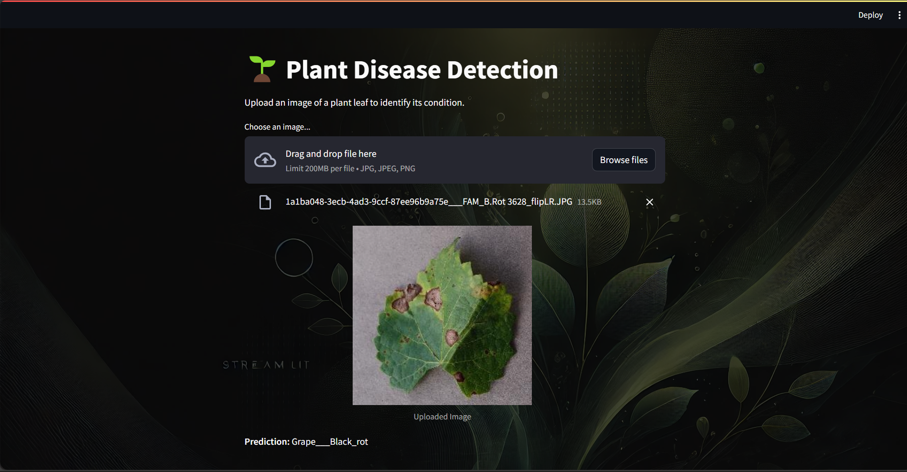

# Plant Disease Detection

A machine learning project to detect plant diseases from leaf images using PyTorch and Streamlit.

## Features
- Real-time plant disease detection from leaf images.
- Uses EfficientNet-B1 for high accuracy.
- Interactive web application with Streamlit.

## Dataset Infomation
New Plant Diseases Dataset
Image dataset containing different healthy and unhealthy crop leaves.
[Plant Disease Detection Dataset](https://www.kaggle.com/datasets/vipoooool/new-plant-diseases-dataset/data?select=New+Plant+Diseases+Dataset%28Augmented%29)

## Training Data Setup
```
plant-disease-detection/
│
├── data/
│   ├── train/
│   │   ├── Class1/
│   │   ├── Class2/
│   │   └── ...
│   └── test/
│       ├── Class1/
│       ├── Class2/
│       └── ...
├── app.py
├── background_1.webp
├── disease_detection.ipynb
├── model.pth
├── requirements.txt
└── README.md
```

## Installation

1. Clone the repository:
   ```
   git clone https://github.com/your-username/plant-disease-detection.git
   ```
2. Navigate to the project directory:
   ```
   cd plant-disease-detection
   ```
3. Install the required dependencies:
   ```
   pip install -r requirements.txt
   ```

## Usage

1. Run the Streamlit application:
   ```
   streamlit run app.py
   ```
2. The application will open in your default web browser.
3. Upload an image of a plant leaf to identify its condition.
4. The application will analyze the image and display the predicted plant disease.

## Screenshots




## Module Summary 
Each module is used in your plant disease detection project:

### PyTorch (`torch`)
PyTorch is an open-source machine learning library used for various tasks such as building and training neural networks.
- **`torch`**: Provides the core tensor operations.
- **`nn`**: Contains modules for creating neural network layers.
- **`DataLoader`**: Utilized for loading data efficiently during training.

### Torchvision (`torchvision`)
Torchvision is a package consisting of popular datasets, model architectures, and common image transformations for computer vision.
- **`efficientnet_b1`**: Pre-trained EfficientNet-B1 model used for transfer learning.
- **`EfficientNet_B1_Weights`**: Pre-trained weights for the EfficientNet-B1 model.
- **`ImageFolder`**: Dataset class for loading images from a directory.
- **`transforms`**: Provides image transformation functions for data augmentation and preprocessing.

### Typing (`typing`)
The typing module provides type hints to improve code readability and maintainability.
- **`OrderedDict`**: Ensures the order of elements is preserved when storing data in a dictionary-like format.

### NumPy (`numpy`)
NumPy is a fundamental library for numerical computing in Python.
- **`np`**: Alias for NumPy, used for array operations and mathematical functions.

### Matplotlib (`matplotlib`)
Matplotlib is a plotting library used for creating static, animated, and interactive visualizations in Python.
- **`plt`**: Alias for Matplotlib's `pyplot` module, used for creating plots and graphs.

### TQDM (`tqdm`)
TQDM is a fast, extensible progress bar for Python.
- **`tqdm`**: Used to display a progress bar for loops, making it easier to track training progress.

### Torchmetrics (`torchmetrics`)
Torchmetrics is a collection of metrics for machine learning and deep learning with PyTorch.
- **`torchmetrics`**: Provides various metrics for evaluating model performance.

### Torchinfo (`torchinfo`)
Torchinfo is a module for displaying a detailed summary of PyTorch models.
- **`summary`**: Generates a summary of the model architecture, including the number of parameters and layers.

### Streamlit (`streamlit`)
Streamlit is a framework for creating interactive web applications for machine learning projects.
- **`st`**: Alias for Streamlit, used to create web-based user interfaces for the project.

### Pillow (`PIL`)
Pillow is an image processing library in Python.
- **`Image`**: Provides classes and functions for opening, manipulating, and saving various image file formats.
